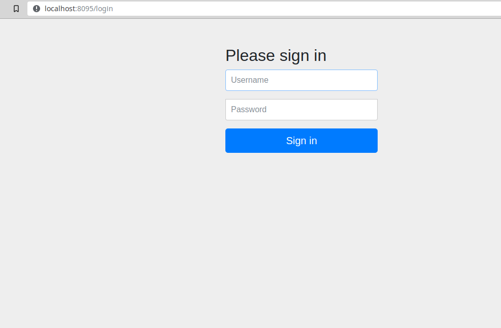

# Seguridad Web : Autenticación y Control de acceso
La mayoría de los sitios web actuales cuentan ya con certificado de seguridad conocido como 
 SSL,  *Secure Socket Layer* por sus siglas en inglés<br><br>
 Sin embargo, la seguridad de un sitio web va más allá de eso y como veremos, la mayoría de los
  sitios web son inseguros.<bR><br>
  Sin embargo, en un estudio realizado por David Stuttard y Marcus Pinto, analizaron en
  2016 cientos de sitios web y encontraron que el siguiente porcentaje tenía los siguientes 
  problemas de seguridad:<br><br>
  * Broken authentication (62%)
  <br>Este tipo de vulnerabilidad ataca las vulnerabilidades en el logeo de las aplicaciones
  <br><br>
  * Broken access controls (71%)<br>
  Este tipo de vulnerabilidad  ataca principalmente  todo lo relacionado a 
  los datos del usuario, asi como poder robar privilegios de los mismos<br><br>
  
  
 
  * SQL injection (32%)<br>
  Este tipo de vulnerabilidad permite a los hackers aprovecharse de las malas prácticas de
   SQL e inyectar sentencias elaboradas que permiten obtener listas de usuarios junto con sus
   contraseñas y demás  información<br><br>
  
  * Cross-site scripting (94%)
  <br><br>
  ESte tipo de vulnerabilidad permite a los atacantes tener acceso a los datos de distintos usuarios  de la aplicación 
  sin tener la autorización.<br><br>
  
  * Information leakage (78%)
  <br>
  En esta vulnerabilidad los atacantes pueden divulgar información de los usuarios de la 
  aplicación web por medio del manejo de errores y otros comportamientos de la aplicación web
  <br><br>
  
  * Cross-site request forgery (92%)
  <br>
  Esta vulnerabilidad hae que los atacantes puedan inducir a los usuarios del sistema a 
   llevara cabo acciones mal intencionadas usando sus privilegios y el contexto que 
   poseen dentro de la aplicación<br><br>
  
  Con estos datos nos damos cuenta que los "huecos" de seguridad  de las aplicacionesa web 
  están más marcados en lo que es el *Cross-site request forgery* y *Cross-site scripting*, en este tutorial 
  nos dedicaremos a mostrar dicha vulnerabilidad asi como desarrollar una apliación para 
  prevenir dicho ataque.
  
  Como plataforma de desarrollo vamos a usar JAVA , junto con la tecnología *Spring-Boot* y el ambiente de desarrollo
  IntellijIDEA es su versión comunitaria.
  
  El ambiente de desarrollo se puede descargar del siguiente sitio [En su version comunitaria](https://www.jetbrains.com/idea/download/#section=linux)
  
  
  
  Vamos a usar una herramienta de nube que recomienda *Spring Boot* para generar la plantilla de nuestro proyecto.
  El objetivo es mostrar las vulnerabilidades y equipar con la información necesaria una aplicación web en donde
  se requiera elaborar un proyecto web  que necesite proveer de servicios web.
  
  En el siguiente sitio se puede [generar y descargar la plantilla de la aplicacion](https://start.spring.io/).  Vamos a usar
  la herramienta de nueva para obtener las dependencias del proyecto, así como las librerías necesarias para llevar a cabo todo el ejercicio
  
  En la siguiente imagen se muestra la pantalla de acceso de dicha herramienta
  
  
  Todo el proyecto terminado se puede descargar de este repositorio, es necesario que tengas instalado el IDE IntellijIDEA y la versión 10 de la JDK de JAVA.
  En el siguiente video se muestra  cómo generar el proyecto con als dependencias necesarias de seguridad  que vamos a utilizar.
  
  
  **DA CLICK EN LA SIGUIENTE IMÁGEN PARA VER EL VIDEO**
  
  [](https://sierra-guadalupe.org/primero-seguridad.mp4)
  
  
  En el video anterior  te indicamos cómo configurar, descargar y ejecutar el proyecto para implementar la seguridad web, 
     en el mismo al final se debe de mostar en el puerto 8095 un formulario de login, lo cual indica que configuraste bien el proyecto
   
   Se  debe de mostrar como en la siguiente figura:
   
   
   Una vez realizado lo anterior vamos a preoceder a generar un servicio web del estilo REST, para poder ser accesado por un cliente  externo, el cual
   puede ser el navegador web o bien un cliente inteligente (smart phone).
   
   Primero vamos a generar una clase que se llame  **WebSecurityConfig**, la genera en la carpeta java, la cual se encuetra en la carpeta **main** de tu 
    proyecto, y en ella vas a copiar el siguiente código
    
    ```
    import org.springframework.context.annotation.Bean;
    import org.springframework.security.config.annotation.web.builders.HttpSecurity;
    import org.springframework.security.config.annotation.web.builders.WebSecurity;
    import org.springframework.security.config.annotation.web.configuration.EnableWebSecurity;
    import org.springframework.security.config.annotation.web.configuration.WebSecurityConfigurerAdapter;
    import org.springframework.security.core.userdetails.User;
    import org.springframework.security.core.userdetails.UserDetails;
    import org.springframework.security.core.userdetails.UserDetailsService;
    import org.springframework.security.provisioning.InMemoryUserDetailsManager;
    import org.springframework.web.cors.CorsConfiguration;
    import org.springframework.web.cors.CorsConfigurationSource;
    import org.springframework.web.cors.UrlBasedCorsConfigurationSource;
    
    import java.util.Arrays;
    
    @EnableWebSecurity
    public class WebSecurityConfig extends WebSecurityConfigurerAdapter {
    
        @Bean
        public UserDetailsService userDetailsService() {
            InMemoryUserDetailsManager manager = new InMemoryUserDetailsManager();
    
            User.UserBuilder userBuilder = User.withDefaultPasswordEncoder();
            UserDetails alumno = userBuilder.username("unitec").password("unitec2019").roles("USER").build();
            UserDetails admin = userBuilder.username("admin").password("admin2019").roles("USER","ADMIN").build();
    
           manager.createUser(User.withDefaultPasswordEncoder().username("user").password("password").roles("USER").build());
            manager.createUser(alumno);
            manager.createUser(admin);
            return manager;
        }
    
        @Override
        public void configure(WebSecurity web) {
            web
                    .ignoring()
                    .antMatchers("/borrego/**")
                    .antMatchers("/public/**");
        }
    
    
    /*
     con estas línea establecemos el acceso  de clientes remotos a la aplicación: Cross Site Request Forgery
     */
        protected void configure(HttpSecurity http) throws Exception {
            http
    
                    .authorizeRequests()
                    .antMatchers("/resources/**", "/signup", "/a   bout","http://localhost:4200    ").permitAll()
                    .antMatchers("/admin/**").hasRole("ADMIN")
                    .antMatchers("/db/**").access("hasRole('ADMIN') and hasRole('DBA')")
                    .anyRequest().authenticated()
                    .and().httpBasic().and().csrf().disable();
    
    
            http.cors();
        }
    
        @Bean
        public CorsConfigurationSource corsConfigurationSource() {
            final CorsConfiguration configuration = new CorsConfiguration();
            configuration.setAllowedOrigins(Arrays.asList("*"));
            configuration.setAllowedMethods(Arrays.asList("HEAD",
                    "GET", "POST", "PUT", "DELETE", "PATCH"));
    
    
            configuration.setAllowCredentials(true);
            // setAllowedHeaders este es importantisimo si no se hace el se lanza el error 403 de orígenes no permitidos
            //
            configuration.setAllowedHeaders(Arrays.asList("Authorization", "Cache-Control", "Content-Type"));
            final UrlBasedCorsConfigurationSource source = new UrlBasedCorsConfigurationSource();
            source.registerCorsConfiguration("/**", configuration);
            return source;
        }
    
    }
    ```
    
     
   